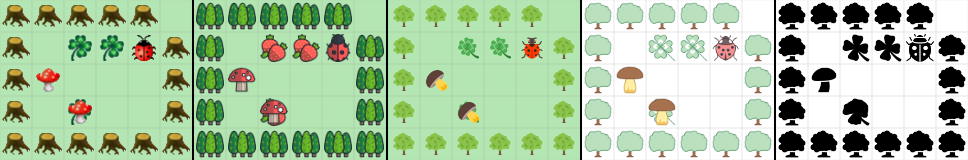

# JavaScriptKara



JavaScriptKara aims to teach students fundamental ideas of programming.

Kara is like [Sokoban](https://en.wikipedia.org/wiki/Sokoban). It is very popular in [German speaking countries](https://de.wikipedia.org/wiki/Kara_(Programmierumgebung)) to teach students how to program. JavaScriptKara reimplements [JavaScriptKara from swisseduc.ch](http://www.swisseduc.ch/informatik/karatojava/javascriptkara/). 

In contrast to the original JavaScriptKara itself is written in JavaScript and is under Mozilla Public License 2.0.

Real world use: [ada7.de](https://ada7.de/c/pD9Tf)


## Download

Just grab `js/sokoban.js` and `img` and you are ready to go.


## Live

[Demo](https://wi-wissen.github.io/JavaScriptKara/demo/demo.html)

[Editor](https://wi-wissen.github.io/JavaScriptKara/demo/editor.html)

## How to use

For full example see: `demo/demo.html`

```js
w = 32; //cellsize in px
margin = 2; //margin inside cell in px
wait = 800; //wait between each move and turn of kara in ms
style = "flaticon"; // use: classic, flaticon, icon8_color, icon8_ios or icon8_office

/*
	#: Tree
	@: Kara
	.: Leaf
	$: Mushroom
	*: Mushroom on a Leaf
	+: Kara on a Leaf

*/

// Be aware that space in front of line are interpretated as empty fields.
karasworld = `world:
#####
# .. #
# @$ #
# *  #
######`

//All settings above are optional. You only have to run this:
setup();

/*
kara
	senor: onLeaf(), treeFront(), treeLeft(), treeRight(), mushroomFront()
	actor: move(), turnLeft(), turnRight(), putLeaf(), removeLeaf()
*/

function run() {
	kara.move();
	kara.turnLeft();
	kara.move();
	if (kara.onLeaf()) {
		kara.removeLeaf();
	}
	if (kara.treeFront()) {
		kara.turnRight();
		kara.move();
	}
	if (kara.treeLeft()) {
		kara.putLeaf();
		kara.turnRight();
		kara.move();
	}
  
  function turnaround() {
    kara.turnRight();
    kara.turnRight();
  }
  
  turnaround();
}
```

Syntax for creating a world is compatibel to [GreenfootKara](https://github.com/marcojakob/greenfoot-kara).


### Contributing

I would love to see JavaScriptKara in action! Please release your excesices with JavaScriptKara to help other teachers to make there lessons also greate. :smile:

Thank you for considering contributing to the JavaScriptKara! Create a pull request or contact [me](https://wi-wissen.de/contact.php).


## Licence

JavaScript is licenced under Mozilla Public License 2.0. Just name me on the same page and link to this page or [wi-wissen.de](https://wi-wissen.de/). On printed works you have to name me with my realname like other authors or contributors. If you made changes to JavaScriptKara you have to provide the source code.

All icons are designed by very talented people. Please respect there copyright:

* classic by [SwissEduc (licence in German)](http://www.swisseduc.ch/about/copyright/)
* flaticon by Freepik from [flaticon.com](https://support.flaticon.com/hc/en-us/articles/207248209)
* icon8_* by [Icons8](https://icons8.crisp.help/en/article/where-do-i-set-the-link-irwkfh/)